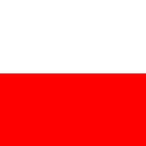

# Bandiere

In questa cartella troverete un progetto Intellij che se avviato è in grado di generare la bandiera della Polonia.

Dentro il progetto troverete due metodi vuoti chiamati italia e francia che dovranno generare le rispettive bandiere: implementateli!

&nbsp; &nbsp; &nbsp; &nbsp; &nbsp; &nbsp; &nbsp; &nbsp;  